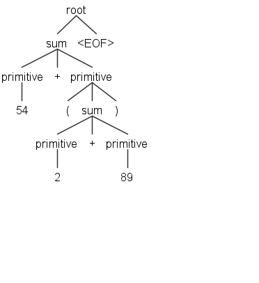

+++

date = '2025-03-04T11:51:53+08:00'
draft = false
title = 'Expressivo'
description = "一个自制的简易求导工具"
image = "complex_facial_expression.jpg"
categories = ["recursive data type", "Regular Expression", "java"]

+++


如果我们不必每次都手动计算微积分作业的导数，那岂不是美妙极了？要是能把它输入电脑，让电脑替我们完成，那该有多惬意！

例如，我们可以这样与之互动(">"后为用户输入):

```bash
> x * x * x
x*x*x

> !simplify x=2
8

> !d/dx
(x*x)*1+(x*1+1*x)*x

> !simplify x=0.5000
.75

> x * y
x*y

> !d/dy
0*y+x*1
```

## keywords

* RDT(recursive data type)
  * AST(abstract syntax tree)
* Regular Expression
  * ANTLR(一个解析器生成器)

为了实现这个简易的求导小程序, 我利用AST(abstract syntax tree)来表示一个数学表达式, 并使用ANTLR来根据用户输入生成抽象语法树.

## Representing Expressions

首先需要一个表示数学表达式(支持 +, *, 变量)的接口

```java
/**
 * An immutable data type representing a polynomial expression of:
 *   + and *
 *   nonnegative integers and floating-point numbers
 *   variables (case-sensitive nonempty strings of letters)
 */
public interface Expression {
    /**
     * @return a parsable representation of this expression, such that
     * for all e:Expression, e.equals(Expression.parse(e.toString())).
     */
    @Override 
    public String toString();

    /**
     * @param thatObject any object
     * @return true if and only if this and thatObject are structurally-equal
     * Expressions, as defined in the PS3 handout.
     */
    @Override
    public boolean equals(Object thatObject);
    
    /**
     * @return hash code value consistent with the equals() definition of structural
     * equality, such that for all e1,e2:Expression,
     *     e1.equals(e2) implies e1.hashCode() == e2.hashCode()
     */
    @Override
    public int hashCode();
}
```

那我们如何设计Expression的具体实现呢, 我觉得先看看一个表达式(54 + (2 + 89))的AST会有所帮助



可以看到, 如果我们把每一个数字(叶子节点)看作一个表达式Number, 那么这里的sum就可以看作一个表达式Plus, Plus包含左表达式和右表达式, 类似地, 乘法我们也可以实现一个Multiply类, 同样包含左表达式和右表达式. 那这样我们如何处理运算的优先级呢, 稍后的antlr grammer会解答这个问题

### equals

如何判断两个表达式相等, 我还纠结了一会, ((54 + 2) + 89)和(54 + (2 + 89))是否相等, 2 + 54 + 89呢, 各种顺序, 括号都让我困扰, 但是不慎重考虑这些又会在之后的测试, Differentiation以及Simplification操作中带来麻烦 , 但是最后, 还是简单暴力地定义为
$$
plus1.equals(plus2) \iff \\ plus1.left.equals(plus2.left) \land plus1.right.equals(plus2.right)
$$

## Parsing Expressions

接下来看看如何把用户输入解析为AST, 具体而言, 我们需要实现Expression.parse

```java
    /**
     * Parse an expression.
     * @param input expression to parse, as defined in the PS3 handout.
     * @return expression AST for the input
     * @throws IllegalArgumentException if the expression is invalid
     */
    public static Expression parse(String input)
```

给定一个字符串 54 + (2 + 89), 如何生成一颗上图那样的树呢, 我们使用antlr来完成.

如果仅仅只有加法, 我们定义如下语法

```g4
root : sum EOF;
sum : primitive ('+' primitive)*;
primitive : NUMBER | '(' sum ')';
NUMBER : [0-9]+;
```

然后antlr就会帮我们自动生成词法分析器, 解析器生成一颗抽象语法树, 我们只需要自己编写树遍历器, 在遍历树的同时生成Expression就可以了.

想要实现乘法和变量, 实际上我们只需要做一点小小的改变

```antlr
root : sum EOF;
sum : product ('+' product)*;
product : primitive ('*' primitive)*;
primitive : NUMBER | VARIABLE | '(' sum ')';
NUMBER : [0-9]+ ('.' [0-9]+)?;
VARIABLE: [a-zA-Z]+;
```

sum的定义默认帮我们确定了乘法的优先级高于加法, 不得不感慨数学表达式本身这种递归形式的奥妙, 怪不得肖老师要我们去学数论, 群论这些摸不着头脑的东西.

## Differentiation

现在我已经把用户输入变成Expression了, 我要考虑如何对它进行求导操作

根据软件工程中所学, 我可以通过以下方式实现对递归数据类型的操作的模式

* 在抽象数据类型接口中**声明**操作
* 在每个具体变体中（递归地）**实现**该操作

```java
    /**
     * Differentiate an expression with respect to a variable.
     * @param var the variable to differentiate by, a case-sensitive nonempty string of letters.
     * @return expression's derivative with respect to variable.  Must be a valid expression equal
     *         to the derivative, but doesn't need to be in simplest or canonical form.
     */
    public Expression differentiate(String var)
```

根据求导公式, 我马上就写出了各个实现的递归定义

```java
differentiate: this x String -> Expression

 differentiate(Number(value: double), var: String) -> Number(0)
 
 differentiate(Variable(name: String), var: String) -> name == var ? Number(1), Number(0)
 
 differentiate(Plus(left: Expression, right: Expression), var: String) -> Plus(differentiate(left, var), differentiate(right, var))
     
 differentiate(Multiply(left: Expression, right: Expression), var: String) -> Plus(Multiply(differentiate(left, var), right), Multiply(left, differentiate(right, var)))
```

这也再次让我感慨, 原来高中做了那么久的求导题是递归定义的, 我的脑袋竟然在那时候就处理了这么有趣的概念, 好像小镇做题家也没这么一无是处呢.

## Simplification

接着是化简, 要求我们给定某些变量的值, 计算表达式的最终值

```java
    /**
     * Simplify this expression.
     * @param environment maps variables to values.  Variables are required to be case-sensitive nonempty
     *         strings of letters.  The set of variables in environment is allowed to be different than the
     *         set of variables actually found in expression.  Values must be nonnegative numbers.
     * @return an expression equal to the input, but after substituting every variable v that appears in both
     *         the expression and the environment with its value, environment.get(v).  If there are no
     *         variables left in this expression after substitution, it must be evaluated to a single number.
     *         Additional simplifications to the expression may be done at the implementor's discretion.
     * @throws IllegalArgumentException if the expression is invalid
     */
    public Expression simplify(Map<String,Double> environment);
```

同样, 各个实现的递归定义如下

```java
simplify: Expression x Map<String,Double> -> Expression

 simplify(Number(value: double), environment: Map<String,Double>) -> Number(value)
 
 simplify(Variable(name: String), environment: Map<String,Double>) -> environment.get(name) == null ? Variable(name), Number(environment.get(name))
 
 simplify(Plus(left: Expression, right: Expression), environment: Map<String,Double>) -> Plus(left.simplify(environment), right.simplify(environment))
 
 simplify(Multiply(left: Expression, right: Expression), environment: Map<String,Double>) -> Multiply(left.simplify(environment), right.simplify(environment))
     
```

这里产生了一个[疑问](#Q2), 对于如何化简繁琐的表达式, 我摸不着头脑.

与此同时, 起初尝试实现时, 在Plus的实现中我无法判断left/right expression化简后是否包含变量, 如果包含变量, 我就无需处理, 如果不包含, 我则需要计算它们加起来的值, 再返回, 我迫切地想使用instanceof

```java
@Override
public Expression simplify(Map<String, Double> environment) {
    // 递归简化左右子表达式
    Expression simplifiedLeft = left.simplify(environment);
    Expression simplifiedRight = right.simplify(environment);

    // 如果左右子表达式都是 Number，则直接计算结果并返回一个新的 Number
    if (simplifiedLeft instanceof Number && simplifiedRight instanceof Number) {
        double value = ((Number) simplifiedLeft).getValue() + ((Number) simplifiedRight).getValue();
        return new Number(value);
    }

    // 如果其中一个子表达式是 0，则返回另一个子表达式
    if (simplifiedLeft instanceof Number && ((Number) simplifiedLeft).getValue() == 0) {
        return simplifiedRight;
    }
    if (simplifiedRight instanceof Number && ((Number) simplifiedRight).getValue() == 0) {
        return simplifiedLeft;
    }

    // 如果无法进一步简化，则返回当前 Plus 表达式
    return new Plus(simplifiedLeft, simplifiedRight);
}
```

但是立刻, 我想起来在学习递归数据类型时书上的[提醒](https://web.mit.edu/6.102/www/sp24/classes/11-recursive-data-types/#@instanceof_operator_tests), 当我在equals以外的地方想用intanceof时, 不妨退一步想想, 我到底需要什么操作. 最后得出的结论是, 我实际上需要知道Expr的值(无论是否有变量), 并不关系expr是否是Number, 所以我在接口中添加了一个method

```java
    /**
     * 计算当前表达式的值
     * @return 表达式的值, 如果有未知变量则为Optional.empty()
     */
    public Optional<Double> result();
```

顺便还用了用最近在[C++](https://web.stanford.edu/class/archive/cs/cs106l/cs106l.1254/lectures/2025Winter-14-Optional&TypeSafety.pdf)中学的Option, 尝试避免成为[10亿美元错误](https://medium.com/madhash/how-null-references-became-the-billion-dollar-mistake-bcf0c0cc72ef)的一部分

## Testing

测试方面, 遵循[教材](https://web.mit.edu/6.102/www/sp24/classes/02-testing/)介绍的分区选择测试用例的测试策略, 对最终的Expression.differentiate和Expression.simplify进行了"黑盒"测试(由于equals的定义, 我必须知道表达式字符串会被解析为什么样的AST, 才能知道预期表达式是什么样的), 所以一定程度上依赖了我的实现.

## Summary

作为第一次尝试实现递归数据类型, 也是第一次尝试解析用户输入, 目前结果至少是能计算"+"与"*"的求导了(尽管求导出的表达式有些繁琐), 工具箱里又多了两个小技能, 又多掌握了一些软件工程的开发模式, 感觉还是非常nice的.

## Question

Q1: 设计函数的spec时, 我到底应不应该@throws, 既然我的测试用例只保证符合spec的输入能产生符合spec的输出, 不符合spec的值的输出时未定义的, 那我要不要让无效输入快速失败, 如果我选择了快速失败, 并注明了@throws, 那我是否应该测试@throws.

Q2: <a id="Q2"></a>如果我想让输出的表达式更简洁一些(比如$x*x*x$求导之后是$3*x*x$, 而不是$((1.0 * (x * x)) + (x * ((1.0 * x) + (x * 1.0))))$), 我该怎么设计, 这里主要的争议就是输出的表达式该简洁到什么程度, 我很难判断, 我只能写一些启发性的代码, 试图让表达式不那么繁琐, 但是我不知道是否有数学原理告诉我最简洁的表达式形式应该是什么样的.

Q3: equals应该如何实现, 项目概述给的定义如下:

**Structural equality** defines two expressions to be equal if:

1. the expressions contain the same variables, numbers, and operators;
2. those variables, numbers, and operators are in the same order, read left-to-right;
3. and they are grouped in the same way.

我不知道为什么要这样定义, 也许是因为这样能保证两个相等的表达式的AST也是相同的, 我觉得数学上相等的表达式就应该相等, 但是与上一个问题类似, 我连化简一个表达式都尚不能解决, 又如何判断数学上是否相等.

## References

项目概述: https://ocw.mit.edu/ans7870/6/6.005/s16/psets/ps3/

antlr参考: https://web.mit.edu/6.005/www/sp16/classes/18-parser-generators/

我的实现: https://github.com/Spiceses/Expressivo

