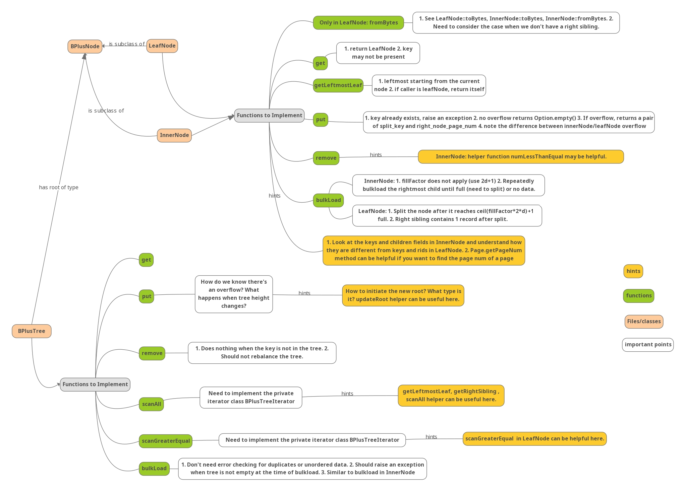

+++

date = '2025-03-04T11:51:53+08:00'
draft = false
title = 'Rookie DB'
description = "a bare-bones database implementation"
image = "derpydb-small.jpg"
categories = ["database", "sql", "B+ tree", "concurrency", "recovery"]

+++

这个项目包含一个基本的数据库实现, 项目框架放在[这里](), 我的实现在[这里]().

本项目中, 我将添加数据库对B+树索引, 高效连接算法, 查询优化, 多粒度锁定(以支持并发事务执行)和数据库恢复的支持.

## B+ Trees

索引的定义: An index is data structure that enables fast lookup and modification of  data entries by search key

在这个项目中, 我们将实现一个B+ Tree用于创建索引. 以下是这部分的结构图:



在实现完上述功能之后, 我们运行

```sql
CREATE INDEX on Students(sid);
```

就会在Students.sid上创建一个索引, 理论上可以加快查询速度.

## Questions

* q: 一个数据库的查询语句执行有哪些环节, 什么时候会用到索引?
